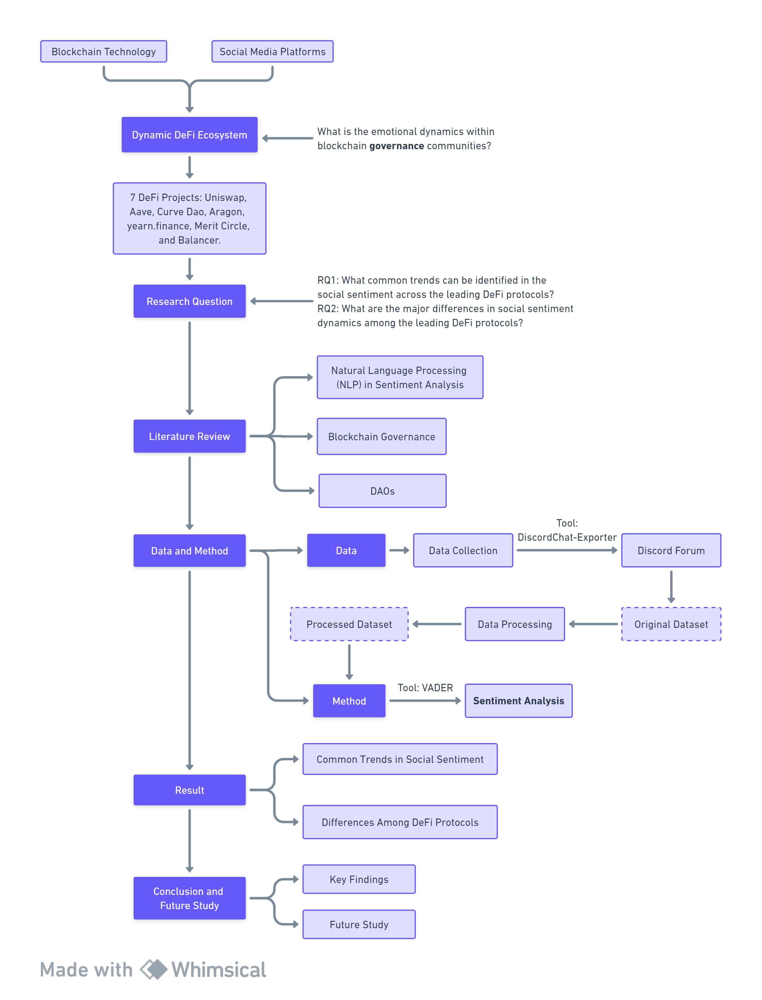
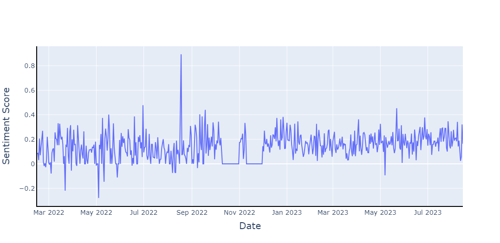

# Decoding Social Sentiment in DAO: A Comparative Analysis of Blockchain Governance Communities

## *Supplementary resources, data, and code*
by **Yutong Quan**, **Xintong Wu**, **Wanlin Deng** and **Luyao Zhang***

(* *corresponding authors*)

 

*Figure 1. Overview of the article: created by [Whimsical](https://whimsical.com/).*

## Table of Contents
- [Data](https://github.com/SciEcon/BlockchainSentiment2023/tree/main#data)
- [Code](https://github.com/SciEcon/BlockchainSentiment2023/tree/main#code)
- [Images]()
- [Reference](https://github.com/SciEcon/BlockchainSentiment2023/tree/main#references)

## Data
 

*Figure 2. Data processed flowchart: created by [Whimsical](https://whimsical.com/).*

### Collected Data

For collecting data from Discord, please refer to [**DiscordChatExporter**](https://github.com/Tyrrrz/DiscordChatExporter). DiscordChatExporter is an application that can be used to export message history from any Discord channel to a file.

- **Data File Information**

| **DeFi Protocols** | **Data File** | **Channel** | **Start Date** | **End Date** | **Message Count** |
| -------------------| ------- | ------- | ------- | ------- | ------- |
| Aave               | [Aave Community - ┌────AAVE Token────┐ - 📜governance [605528212239286312].csv](https://github.com/SciEcon/BlockchainSentiment2023/blob/main/Data/collected/Aave%20Community%20-%20%E2%94%8C%E2%94%80%E2%94%80%E2%94%80%E2%94%80AAVE%20Token%E2%94%80%E2%94%80%E2%94%80%E2%94%80%E2%94%90%20-%20%F0%9F%93%9Cgovernance%20%5B605528212239286312%5D.csv) | governance | 8/2/2019 | 7/27/2023 | 3,844 |
| Uniswap            | [Uniswap - Governance - 🏛│governance [755969053280960533].csv](https://github.com/SciEcon/BlockchainSentiment2023/blob/main/Data/collected/Uniswap%20-%20Governance%20-%20%F0%9F%8F%9B%E2%94%82governance%20%5B755969053280960533%5D.csv) | governance | 9/17/2020 | 8 13/2023 | 11,583 |
| Curve DAO          | [Curve Finance - General - curve-governance [745257323487953036].csv](https://github.com/SciEcon/BlockchainSentiment2023/blob/main/Data/collected/Curve%20Finance%20-%20General%20-%20curve-governance%20%5B745257323487953036%5D.csv) | curve-governance | 8/18/2020 | 8/15/2023 | 8,774 |
| Aragon             | [Aragon 🦅 - DAO Builders - dao-builders-chat [1036975360551702568].csv](https://github.com/SciEcon/BlockchainSentiment2023/blob/main/Data/collected/Aragon%20%F0%9F%A6%85%20-%20DAO%20Builders%20-%20dao-builders-chat%20%5B1036975360551702568%5D.csv) | dao-builders-chat | 11/20/2022 | 8/15/2023 | 702 |
| yearn.finance      | [Yearn Talk - general - 🗳governance [734805853768777738].csv](https://github.com/SciEcon/BlockchainSentiment2023/blob/main/Data/collected/Yearn%20Talk%20-%20general%20-%20%F0%9F%97%B3governance%20%5B734805853768777738%5D.csv) | governance | 7/20/2020 | 8/2/2023 | 7,214 |
| Merit Circle       | [Merit Circle - 💬 Chats & Voice──────────── - ╭💬・general-chat [942785405617582110].csv](https://github.com/SciEcon/BlockchainSentiment2023/blob/main/Data/collected/Merit%20Circle%20-%20%F0%9F%92%AC%20Chats%20%26%20Voice%E2%94%80%E2%94%80%E2%94%80%E2%94%80%E2%94%80%E2%94%80%E2%94%80%E2%94%80%E2%94%80%E2%94%80%E2%94%80%E2%94%80%20-%20%E2%95%AD%F0%9F%92%AC%E3%83%BBgeneral-chat%20%5B942785405617582110%5D.csv) | general-chat | 2/14/2022 | 8/15/2023 | 34,786 |
| Balancer           | [Balancer - 🏡 _ Discussions - 💬︲general-chat [638460494168064025].csv](https://github.com/SciEcon/BlockchainSentiment2023/blob/main/Data/collected/Balancer%20-%20%F0%9F%8F%A1%20_%20Discussions%20-%20%F0%9F%92%AC%EF%B8%B2general-chat%20%5B638460494168064025%5D.csv) | general-chat | 11/29/2019 | 8/15/2023 | 51,707 |

- **Data Dictionary**

| **Variable Name**	| **Unit**	| **Data Type**	| **Description** |
| ------- | ------- | ------- | ------- |
| AuthorID	| Count | int64 | This identifier uniquely distinguishes the authors of the discussions, allowing for tracking and attribution. |
| Author | Name |int64 | The name or username of the discussion participants. |
| Date_original | Minutes | int64 | The timestamp indicates when each discussion occurred, providing a temporal dimension to the dataset (shown in minutes). |
| Date | Days | int64 | The timestamp indicates when each discussion occurred, providing a temporal dimension to the dataset (shown in days). |
| Content | Text | int64 | The textual content of the discussions, including messages, comments, and replies. |
| Attachments | File/Link/Image | int64 | Information regarding any attached files, images, or media shared within the discussions. |
| Reactions | Emoji | int64 | A record of reactions, such as emojis, associated with each discussion, offering insights into community engagement and sentiment. |

### Analyzed Data
- **Data File Information**

| **DeFi Protocols** | **Data File** | **Description** |
| ------- | ------- | ------- |
| **Aave** | [aave_cleaned_discord.csv](https://github.com/SciEcon/BlockchainSentiment2023/blob/main/Data/analyzed/aave_cleaned_discord.csv) | This file provided the preprocessed content from the collected dataset of Aave. | 
| | [aave_daily_sentiment.csv](https://github.com/SciEcon/BlockchainSentiment2023/blob/main/Data/analyzed/aave_daily_sentiment.csv) | This file contains the daily sentiment score of discussion in the Aave community on Discord. | 
| | [aave_user_sentiment.csv](https://github.com/SciEcon/BlockchainSentiment2023/blob/main/Data/analyzed/aave_user_sentiment.csv) | This file includes the user-based sentiment score of discussion in the Aave community on Discord. | 
| | [aave_volume_discord.csv](https://github.com/SciEcon/BlockchainSentiment2023/blob/main/Data/analyzed/aave_volume_discord.csv) | This file presents the daily discussion volume for the Aave community on Discord. | 
| **Uniswap** | [uniswap_cleaned_discord.csv](https://github.com/SciEcon/BlockchainSentiment2023/blob/main/Data/analyzed/uniswap_cleaned_discord.csv) | This file provided the preprocessed content from the collected dataset of Uniswap. | 
| | [uniswap_daily_sentiment.csv](https://github.com/SciEcon/BlockchainSentiment2023/blob/main/Data/analyzed/uniswap_daily_sentiment.csv) | This file includes the user-based sentiment score of discussion in the Uniswap community on Discord. | 
| | [uniswap_user_sentiment.csv](https://github.com/SciEcon/BlockchainSentiment2023/blob/main/Data/analyzed/uniswap_user_sentiment.csv) | This file presents the daily discussion volume for the Uniswap community on Discord. | 
| | [uniswap_volume_discord.csv](https://github.com/SciEcon/BlockchainSentiment2023/blob/main/Data/analyzed/uniswap_volume_discord.csv) | This file presents the daily discussion volume for the Uniswap community on Discord. | 
| **Curve Dao** | [curve_cleaned_discord.csv](https://github.com/SciEcon/BlockchainSentiment2023/blob/main/Data/analyzed/curve_cleaned_discord.csv) | This file provided the preprocessed content from the collected dataset of Curve Dao. | 
| | [curve_daily_sentiment.csv](https://github.com/SciEcon/BlockchainSentiment2023/blob/main/Data/analyzed/curve_daily_sentiment.csv) | This file includes the user-based sentiment score of discussion in the Curve Dao community on Discord. | 
| | [curve_user_sentiment.csv](https://github.com/SciEcon/BlockchainSentiment2023/blob/main/Data/analyzed/curve_user_sentiment.csv) | This file presents the daily discussion volume for the Curve Dao community on Discord. | 
| | [curve_volume_discord.csv](https://github.com/SciEcon/BlockchainSentiment2023/blob/main/Data/analyzed/curve_volume_discord.csv) | This file presents the daily discussion volume for the Curve Dao community on Discord. | 
| **Aragon** | [aragon_cleaned_discord.csv](https://github.com/SciEcon/BlockchainSentiment2023/blob/main/Data/analyzed/aragon_cleaned_discord.csv) | This file provided the preprocessed content from the collected dataset of Aragon. | 
| | [aragon_daily_sentiment.csv](https://github.com/SciEcon/BlockchainSentiment2023/blob/main/Data/analyzed/aragon_daily_sentiment.csv) | This file includes the user-based sentiment score of discussion in the Aragon community on Discord. | 
| | [aragon_user_sentiment.csv](https://github.com/SciEcon/BlockchainSentiment2023/blob/main/Data/analyzed/aragon_user_sentiment.csv) | This file presents the daily discussion volume for the Aragon community on Discord. | 
| | [aragon_volume_discord.csv](https://github.com/SciEcon/BlockchainSentiment2023/blob/main/Data/analyzed/aragon_volume_discord.csv) | This file presents the daily discussion volume for the Aragon community on Discord. | 
| **Yearn Finance** | [yearnfinance_cleaned_discord.csv](https://github.com/SciEcon/BlockchainSentiment2023/blob/main/Data/analyzed/yearnfinance_cleaned_discord.csv) | This file provided the preprocessed content from the collected dataset of Yearn Finance. | 
| | [yearnfinance_daily_sentiment.csv](https://github.com/SciEcon/BlockchainSentiment2023/blob/main/Data/analyzed/yearnfinance_daily_sentiment.csv) | This file includes the user-based sentiment score of discussion in the Yearn Finance community on Discord. | 
| | [yearnfinance_user_sentiment.csv](https://github.com/SciEcon/BlockchainSentiment2023/blob/main/Data/analyzed/yearnfinance_user_sentiment.csv) | This file presents the daily discussion volume for the Yearn Finance community on Discord. | 
| | [yearnfinance_volume_discord.csv](https://github.com/SciEcon/BlockchainSentiment2023/blob/main/Data/analyzed/yearnfinance_volume_discord.csv) | This file presents the daily discussion volume for the Yearn Finance community on Discord. | 
| **Merit Circle** | [meritcircle_cleaned_discord.csv](https://github.com/SciEcon/BlockchainSentiment2023/blob/main/Data/analyzed/meritcircle_cleaned_discord.csv) | This file provided the preprocessed content from the collected dataset of Merit Circle. | 
| | [meritcircle_daily_sentiment.csv](https://github.com/SciEcon/BlockchainSentiment2023/blob/main/Data/analyzed/meritcircle_daily_sentiment.csv) | This file includes the user-based sentiment score of discussion in the Merit Circle community on Discord. | 
| | [meritcircle_user_sentiment.csv](https://github.com/SciEcon/BlockchainSentiment2023/blob/main/Data/analyzed/meritcircle_user_sentiment.csv) | This file presents the daily discussion volume for the Merit Circle community on Discord. | 
| | [meritcircle_volume_discord.csv](https://github.com/SciEcon/BlockchainSentiment2023/blob/main/Data/analyzed/meritcircle_volume_discord.csv) | This file presents the daily discussion volume for the Merit Circle community on Discord. | 
| **Balancer** | [balancer_cleaned_discord.csv](https://github.com/SciEcon/BlockchainSentiment2023/blob/main/Data/analyzed/balancer_cleaned_discord.csv) | This file provided the preprocessed content from the collected dataset of Balancer. | 
| | [balancer_daily_sentiment.csv](https://github.com/SciEcon/BlockchainSentiment2023/blob/main/Data/analyzed/balancer_daily_sentiment.csv) | This file includes the user-based sentiment score of discussion in the Balancer community on Discord. | 
| | [balancer_user_sentiment.csv](https://github.com/SciEcon/BlockchainSentiment2023/blob/main/Data/analyzed/balancer_user_sentiment.csv) | This file presents the daily discussion volume for the Balancer community on Discord. | 
| | [balancer_volume_discord.csv](https://github.com/SciEcon/BlockchainSentiment2023/blob/main/Data/analyzed/balancer_volume_discord.csv) | This file presents the daily discussion volume for the Balancer community on Discord. | 

- **Data Dictionary**

| **File Classification** | **Variable Name**	| **Unit**	| **Data Type**	| **Description** |
| ------- | ------- | ------- | ------- | ------- |
| *DeFi*_cleaned_discord.csv | AuthorID	| Count | int64 | This identifier uniquely distinguishes the authors of the discussions, allowing for tracking and attribution. |
| | Author | Name |int64 | The name or username of the discussion participants. |
| | Date_original | Minutes | int64 | The timestamp indicates when each discussion occurred, providing a temporal dimension to the dataset (shown in minutes). |
| | Date | Days | int64 | The timestamp indicates when each discussion occurred, providing a temporal dimension to the dataset (shown in days). |
| | Content | Text | int64 | The textual content of the discussions, including messages, comments, and replies. |
| | Attachments | File/Link/Image | int64 | Information regarding any attached files, images, or media shared within the discussions. |
| | Reactions | Emoji | int64 | A record of reactions, such as emojis, associated with each discussion, offering insights into community engagement and sentiment. |
| | Preprocessed | Text | int64 | The preprocessed textual content of the discussions with lowercasing, URL removal, special character removal, tokenization, stopword removal, and punctuation removal. |
| *DeFi*_daily_sentiment.csv | Date | Days | datetime64 | The timestamp indicates when each discussion occurred, providing a temporal dimension to the dataset (shown in days). |
| | Sentiment Score | Range=[-1,1] | int64 | The calculated average sentiment score for each day with discussion occurred. |
| *DeFi*_user_sentiment.csv | AuthorID | Count | int64 | This identifier uniquely distinguishes the authors of the discussions, allowing for tracking and attribution. |
| | Average_Sentiment_Score | Range=[-1,1] | int64 | The calculated average sentiment score for each author who participated in the discussion. |
| *DeFi*_volume_discord.csv | Date | Days | datetime64 | The timestamp indicates when each discussion occurred, providing a temporal dimension to the dataset (shown in days). |
| | Discord Volume | Count | int64 | The daily discussion volume on DeFi protocols' Discord channel.|

## Code
| **DeFi Protocols** | **Google Colab File Name**|
| ------- | ------- |
| Aave | [Aave.ipynb](https://github.com/SciEcon/BlockchainSentiment2023/blob/main/Code/Aave.ipynb) |
| Uniswap | [Uniswap.ipynb](https://github.com/SciEcon/BlockchainSentiment2023/blob/main/Code/Uniswap.ipynb) |
| Curve Dao | [Curve_Dao.ipynb](https://github.com/SciEcon/BlockchainSentiment2023/blob/main/Code/Curve_Dao.ipynb) |
| Aragon | [Aragon.ipynb](https://github.com/SciEcon/BlockchainSentiment2023/blob/main/Code/Aragon.ipynb.ipynb) |
| yearn.finance | [yearn_finance.ipynb](https://github.com/SciEcon/BlockchainSentiment2023/blob/main/Code/yearn_finance.ipynb) |
| Merit Circle | [Merit_Circle.ipynb](https://github.com/SciEcon/BlockchainSentiment2023/blob/main/Code/Merit_Circle.ipynb) |
| Balancer | [Balancer](https://github.com/SciEcon/BlockchainSentiment2023/blob/main/Code/Balancer.ipynb) |

## Images

## References
**Data Reference:** Discord (https://discord.com/)

**Code Reference:** Tyrrrz/DiscordChatExporter (https://github.com/Tyrrrz/DiscordChatExporter)

